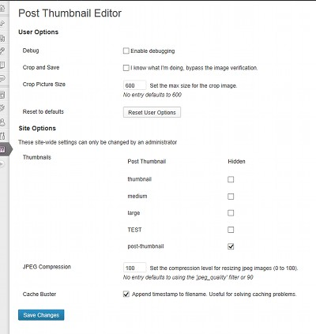
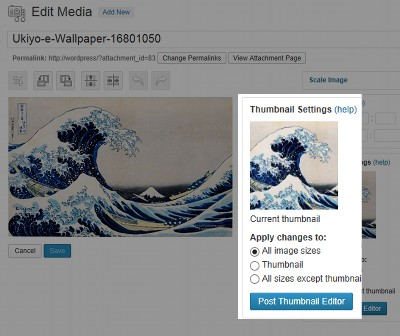
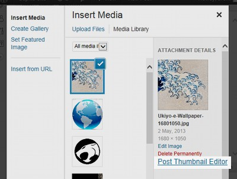
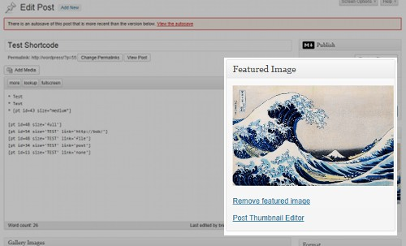
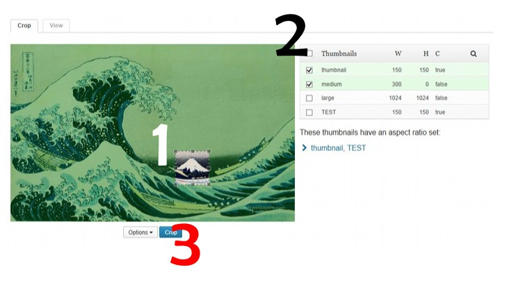
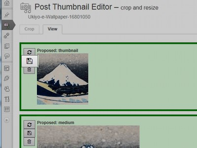
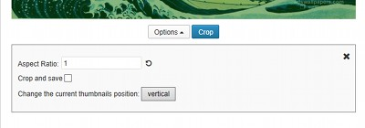

## Post Thumbnail Editor

### About

Wordpress created a really neat concept called [post
thumbnails][wp_post_thumbs]. Post thumbnails allow themes and plugins to define
an image size, that size would be available for every image controlled by
wordpress media gallery. Themes could then depend on a predefined size being
available for any image.

However, if wordpress ever crops an image, it does so exactly from the middle of
the image. This often results in details from the original image being cropped
out of the picture. Wordpress users could manually circumvent this by uploading
their own versions of the cropped picture, but this is a tedious process (crop
in image editor, ftp to site, find original thumbnail, replace).

Post Thumbnail Editor makes this process much simpler and easier.

[wp_post_thumbs]: http://codex.wordpress.org/Post_Thumbnails

#### Features

1. Works on mobile (e.g. iPads/iPhones)
1. Uses Wordpress [Role's and Capabilities][rc] support
1. View all the post-thumbnails for an image
1. Configure the size of the cropping image
1. Site Administrator can hide/disable certain post-thumbnails from the editor
   user interface
1. Set the JPEG compression
1. Change the thumbnail filename to avoid caching issues

[rc]: http://codex.wordpress.org/Roles_and_Capabilities

### Installation

#### Download

Download Post Thumbnail Editor and unzip it to your `wp-content/plugins`
directory.  Alternately, use Wordpress' plugin updater to automatically install
the stable version.

<a class="btn btn-large btn-success" href="http://downloads.wordpress.org/plugin/post-thumbnail-editor.zip">Download Stable</a>
<a class="btn btn-large btn-warning" href="https://github.com/sewpafly/post-thumbnail-editor/archive/master.zip">Download Development</a>

#### Options

Once the editor is installed there will be a new Settings Menu at Settings
&rarr; Post Thumbnail Editor. The options available depend on the permissions
given the current user.

##### User Options

A user with permission to modify any post-thumbnails will have the ability to:

1. **Enable/disable debug mode**

   Changes the user interface from using one concatenated javascript files to
   several javascript files that are loaded asynchronously using requirejs. _If
   the `WP_DEBUG` define is set by the site admin, this is set automatically and
   can't be disabled._

1. **Crop and Save**

   Skips the confirmation step of the cropping process.

1. **Crop Picture Size**

   Defines the maximum dimension of the crop image. _No entry defaults to 600._

1. **Reset to Defaults**

   Resets all user options to the default settings.

##### Site Options

Site Admininstrators have access to change the following options:

1. **Thumbnails**

   Given a list of currently used post-thumbnails *(This changes depending on
   which themes/plugins are enabled.)*, those that are checked are **hidden**
   from the editor interface.

1. **JPEG Compression**

   Set the compression value. *Only applies to modifying `.jpg` images*. 
   * `  0` = lowest quality, smallest filesize
   * `100` = highest quality, largest filesize

   *Defaults to 90*

1. **Cache Buster**

   For those using CDN's and other caching techniques this option will rename
   the cropped thumbnails using the timestamp of when the crop occured to avoid
   caching issues.

### Usage

The editor can be started through:

* The media library **(most stable method)**

  

* Image Editor

  

* Post:

  * Media Library  
      

  * Featured Image meta-box  
      

#### Cropping

1. select an area to crop
1. and a thumbnail to edit
1. then click the crop button. BOOM! Cropped thumbnail. 
1. Click the disk icon to save the crop and you're done.

   *About the other icons:* Use the icon with the spinning arrows to compare the
   new and old thumbnails.  Use the trash can icon to discard your most recent change.

##### Advanced Cropping Options

In the editor you might notice the Options button. Don't touch it. Just kidding,
do whatever you want with it. But if you do click it, it should expose some
settings.

1. **Aspect Ratio**

   Setting this value to a value of `width/height` fixes the crop ratio, which
   will stay fixed until you close the options menu (either by clicking the `X`
   or clicking the "Options" button a second time) or you reset the aspect
   ratio by clicking the counter-clockwise circle.

2. **Crop and Save**

   This is a shortcut for the [same user option](#toc_5) (described above).

3. **Thumbnail Viewer Position**

   Toggle the thumbnail viewer to/from a horizontal/vertical position with this
   button. The editor should remember the last chosen position.

### Support

If you want to report an issue:

1. Enable debugging in the options and try again.
1. File a report on either the [github][gs] or [wordpress][ws] sites, making
   sure to include the following information:
   1. Browser version
   1. Wordpress version
   1. Post Thumbnail Editor version
   1. Detailed description of the problem, including the steps to reproduce

[gs]: http://github.com/sewpafly/post-thumbnail-editor/issues/
[ws]: http://wordpress.org/support/plugin/post-thumbnail-editor
