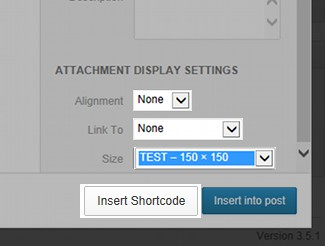
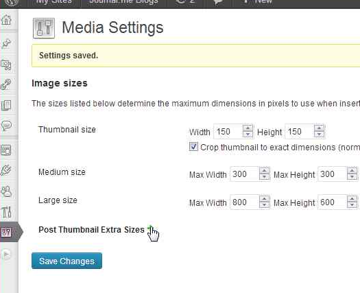
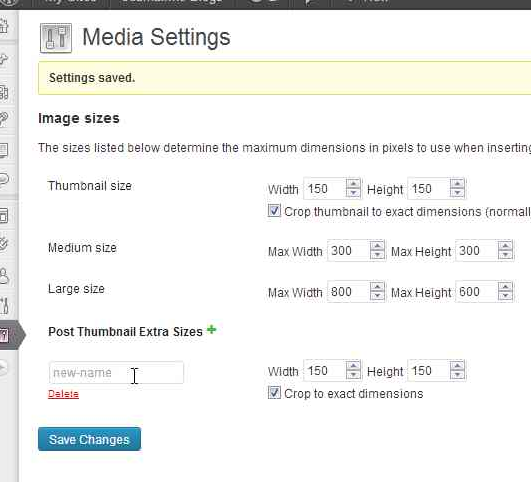

# Post Thumbnail Extras

See on [Wordpress.org][wordpress].

[wordpress]: http://wordpress.org/plugins/post-thumbnail-extras/ "Wordpress Plugin Site"

## About

* Provides a shortcode for embedding post-thumbnails. Authors can quickly change
  pictures in posts without wading through HTML.  This can be awesome in several
  ways: if your post-thumbnails change their width or height due to a theme
  change, or if you have cropped them with another tool (you know, maybe a
  certain [editor](../editor)) -- this will always pull wordpress' latest
  image).
* Includes a hook into the media library to create the above shortcode.
* Add new post thumbnails via Wordpress Settings &rarr; Media.

## Installation

### Download

Download Post Thumbnail Extras and unzip it to your `wp-content/plugins`
directory.  Alternately, use Wordpress' plugin updater to automatically install
the stable version.

<a class="btn btn-large btn-success" href="http://downloads.wordpress.org/plugin/post-thumbnail-extras.zip">Download Stable</a>
<a class="btn btn-large btn-warning" href="https://github.com/sewpafly/post-thumbnail-extras/archive/master.zip">Download Development</a>
<a class="btn btn-large btn-primary" href="http://wordpress.org/plugins/post-thumbnail-extras/">View @ Wordpress Plugins</a>

## Usage

### Shortcode

Use the shortcode `[pt]` in your posts to quickly embed the featured image as a
thumbnail. Use the attribute `'size'` to change to a different post-thumbnail
size (e.g. `[pt size='medium']`). You can also use any image in your media
gallery if you know the id, by using the `id` attribute (`[pt id='100']`).

Use the `link` attribute to wrap the image in a link. 

* `link='file'` will create a link to the full size image.
* `link='post'` will create a link to the attachment page.
* `link='http...'` creates a link to any URL.

Use the media library to quickly add this shortcode for the selected image by
pressing the "Insert shortcode" button.

### Add/Delete Post Thumbnails

1. In Settings &rarr; Media, click the plus sign to add a new post thumbnail.

   

2. Update the width/height and whether or not the post-thumbnail should be
   cropped to an exact size. (If the width or height is set to 0, that boundary
   constraint is not enforced -- effectively, it's infinite). Make sure you
   click the "save" button so that the changes are stored in the database.  

   

## Support

If you want to report an issue:

1. Enable debugging in the options and try again.
2. File a report on either the [github][gsx] or [wordpress][wsx] sites, making
   sure to include the following information:
   1. Browser version
   2. Wordpress version
   3. Post Thumbnail Extras version
   4. Detailed description of the problem, including the steps to reproduce

[gsx]: http://github.com/sewpafly/post-thumbnail-extras/issues/
[wsx]: http://wordpress.org/support/plugin/post-thumbnail-extras
